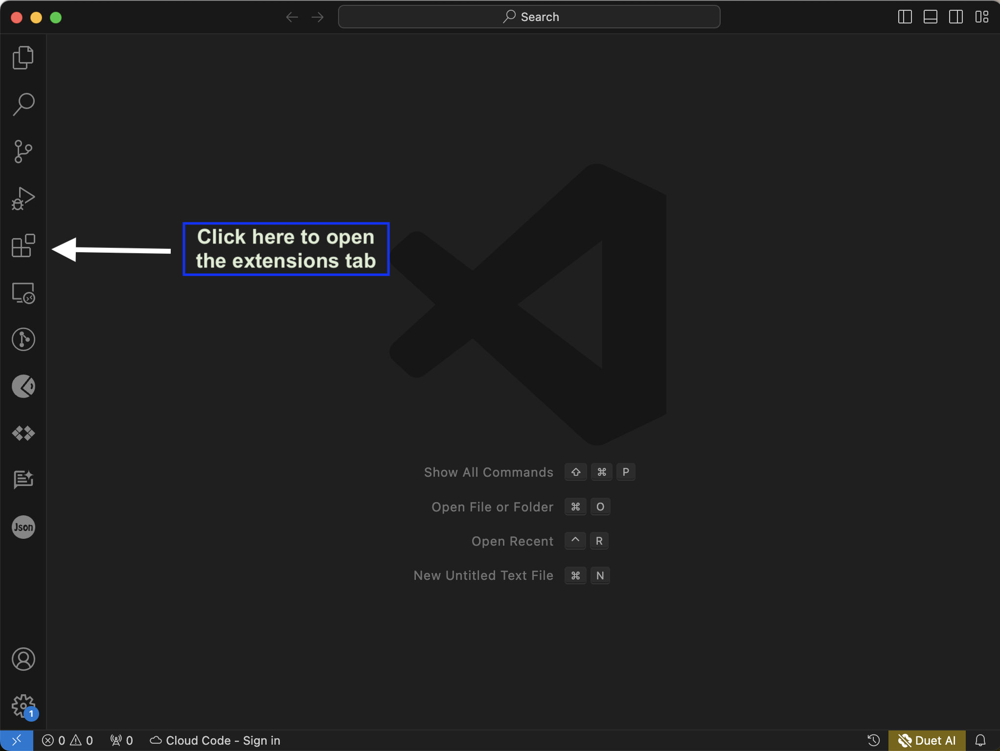
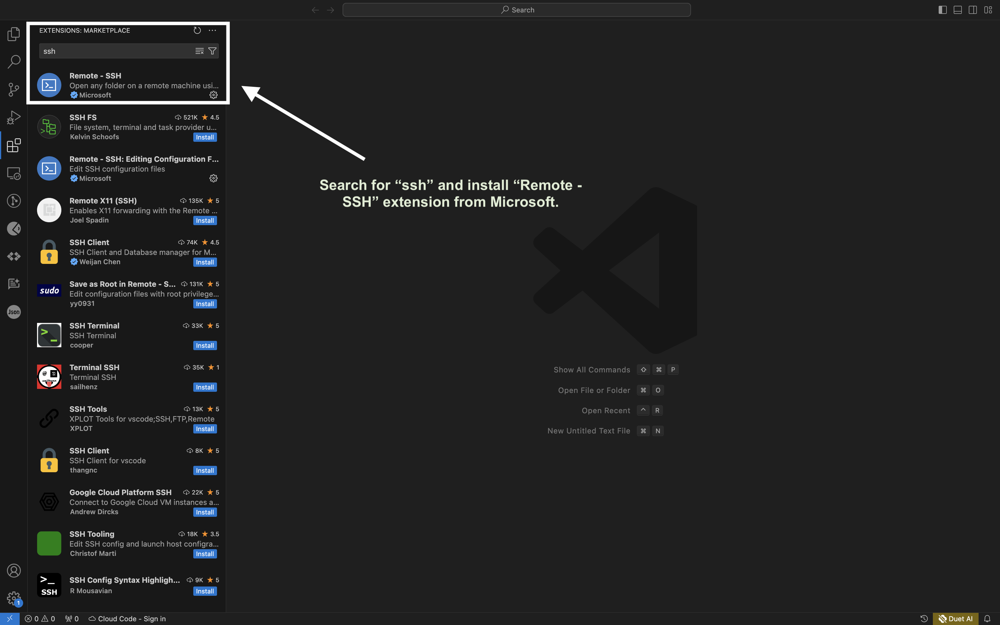
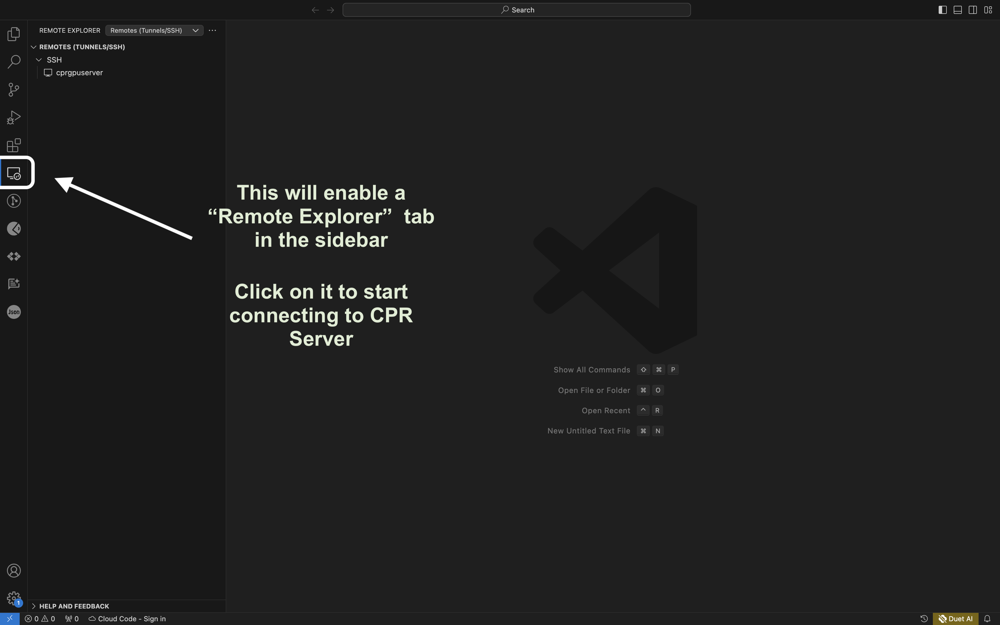
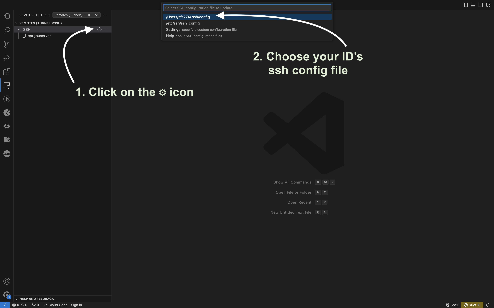
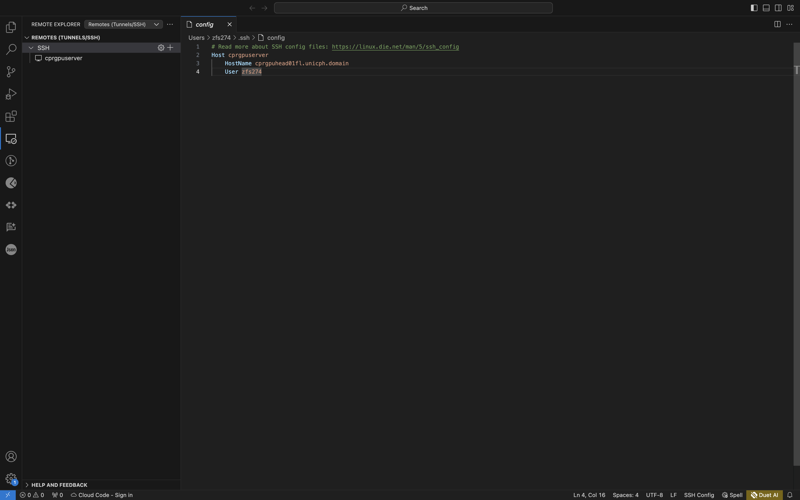
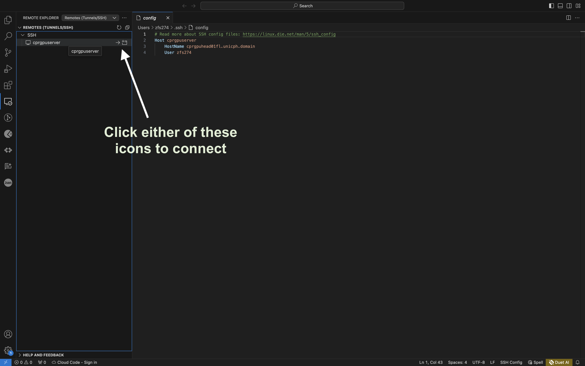
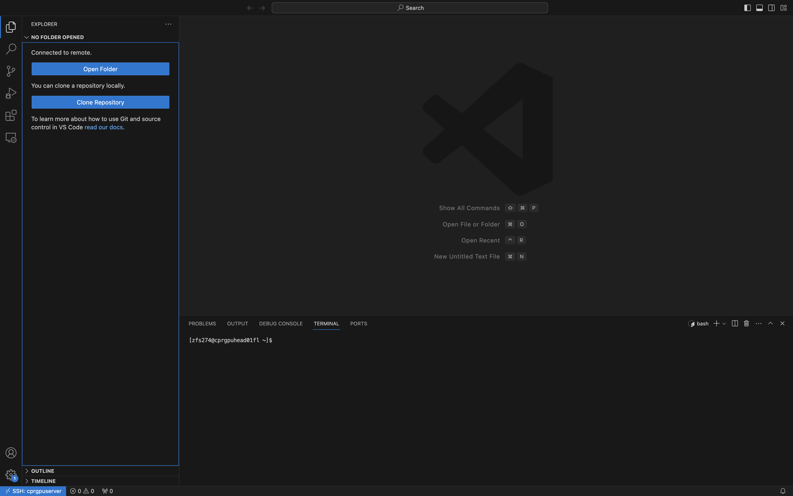

## Step 1: Download and install Visual Studio Code

- [Download VS Code](https://code.visualstudio.com/).
- Install it.

## Step 2: Open VS Code and install the `Remote - SSH` extension



## Step 3: Search for 'ssh' and install the 'Remote - SSH' extension from Microsoft



## Step 4: Go to Remote Explorer



## Step 5: Edit your ssh config file



## Step 6: Enter host details in the config file

```ssh_config
Host cprgpuserver
    HostName cprgpuhead01fl.unicph.domain
    User zfs274
```

The code should look like the screenshot below. Mind the indents. You have to give 1 tab space before `HostName` and `User`.



## Step 7: Connect to the server

Click on the connect icon to open a new SSH connection to the server.



Enter your KU password and hit Enter.

This will open an SSH connection to the server.



You can now open your work directory. Foe example `/projects/cpr-duxin`. You can also use the terminal to issue commands.
